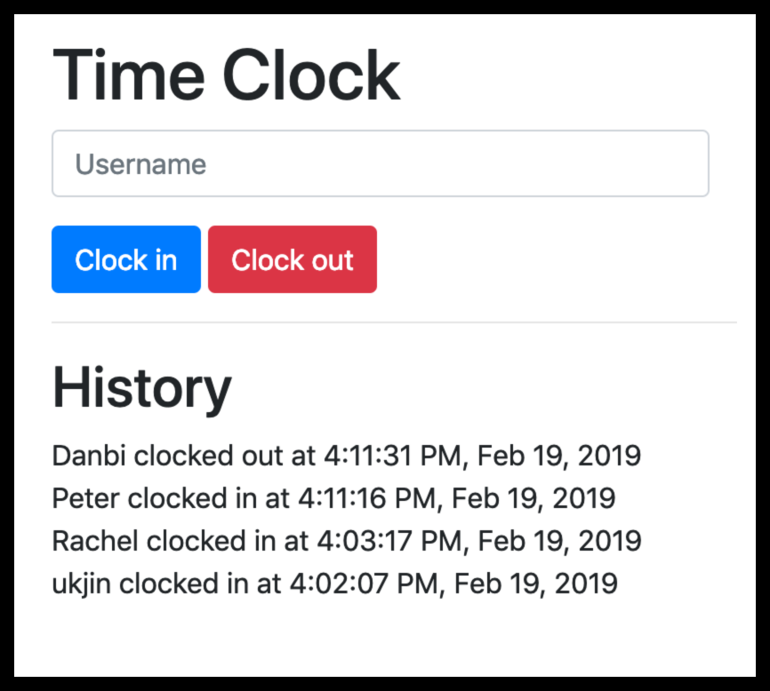

# Time Clock

A time clock application to allow employees to clock-in/clock-out of their offices.

https://time-clock-0219.herokuapp.com/

## Screenshot

## Dependencies

- Rails 5.2.2
- Ruby 2.6.1
- Bootstrap 4.1.3

## Features

- Allow a user to enter their name.
- Allow user to clock either in or out.
- Upon clock event, store user's name, clock type and time.
- Provide a list of all clock events with logged information.
